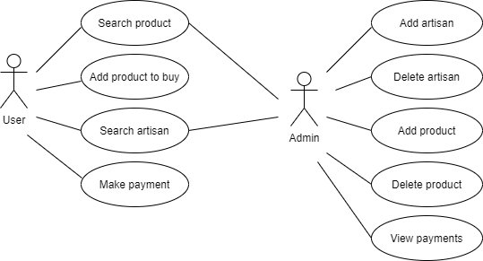
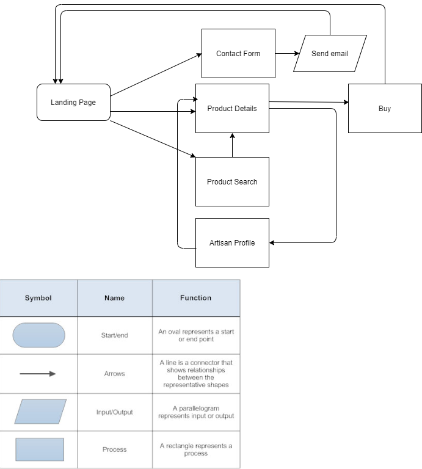

# AwamakiART

## Description
  
  Nowadays there is a huge problem of unconsciuous consumption which has a high impact in our environment and also in our happiness. People buy stuff without any value that they can get from the mall. They don't get to know the workers who had made this goods, besides they are not personalized, just a repetition. And they don't know at all about the labour rights and safety for the worker. 

  This website has two goals:
    - First af all, we want people to be buy in a more conscius way. What if instead of buying a lot of material goods that don't mean anything to you, you buy things with soul. Handmade works made by artisans who do unique works just for you. 

    - On the other hand, we want to give the chance to freelance artisans without finantial help to sell their work for free through this website.
    
## Functional description

This website will have:

    - Landing page: On the landing page the users will be able to understand what is this project about. To watch videos from artisans introducing themselves and showing their work. Also users will be able to see some of the handmade products.

    - Product search: On this site you will be able to search on the whole handmade products database using diferent criterias.

    - Product description: Give the complete information about this product and its materials. And will have a link to the artisan profile.

    - Artisan profile: Will give a description about the kind of work that makes an artisan and about their life. Will give a whatsapp or the preferred contact way for the artisan to contact him/her.

    - Payment checkout: Will give the option to pay by paypal. Otherwise the client can contact the artisan to use another platform for the payment.

### Use cases

### Flow diagram

### Wireframe

